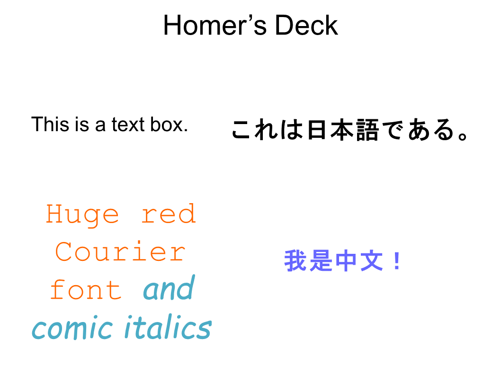
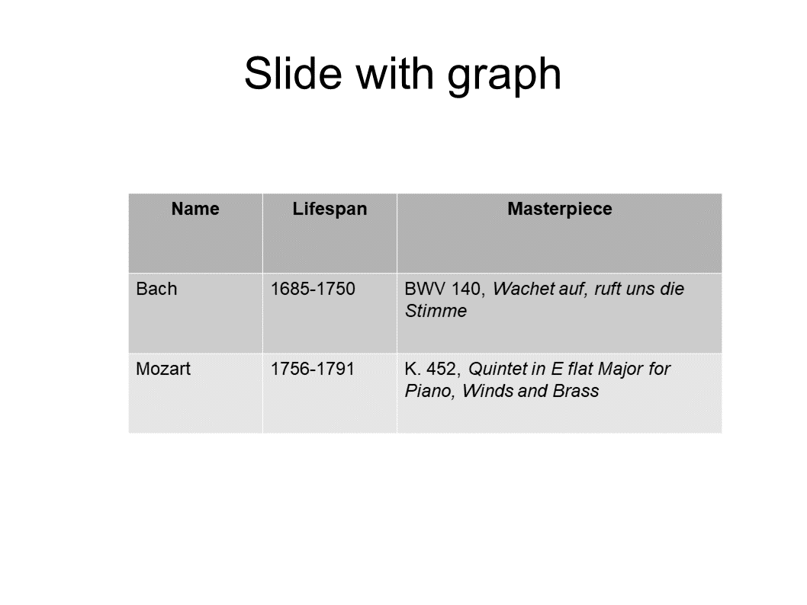

# TranslatePPTX

<span style="text-transform: uppercase; font-size: 70%;">translatepptx</span>
is a very simple code based on the
[Apache POI](https://poi.apache.org)
for facilitating editing or translation of Powerpoint
presentations in `.pptx` format.

Using
<span style="text-transform: uppercase; font-size: 70%;">translatepptx</span>
to edit or translate a Powerpoint file is a three-step process:

1. You do a first run of
   <span style="text-transform: uppercase; font-size: 70%;">translatepptx</span>
   on your `.pptx` file in *text extraction* mode.
   <span style="text-transform: uppercase; font-size: 70%;">translatepptx</span>
   extracts all text strings on all slides in the presentation 
   (including all text boxes, all text in graphs, etc.) and 
   writes these out, with some identifying labeling info,
   to a **plain text file**.

2. You edit this file in your favorite text editor,
   modifying any text strings that you want to edit or translate
   and deleting all the rest. 

3.  Finally, you pass your edited list of text strings as a
    command-line argument to a second run of
    <span STYLE="font-variant: small-caps;">translatepptx</span>,
    now running in *text replacement* mode;
    this time the code replaces all the strings you edited with 
    your edited versions and writes out a new `.pptx` file
    reflecting your edits.

## A tutorial example

Here's an example involving a presentation called
[`MyDeck.pptx`](example/MyDeck.pptx),
which contains two slides and has a couple of text boxes
and a table:

<p align="center">

<table>
 <tr>
  <td> <a href="example/MyDesk_Slide1.png">
       
       </a>
  <td> <a href="example/MyDesk_Slide2.png">
       
       </a>
 </tr>
</table>

### Step 1: Extract text strings

````bash
 % java TranslatePPT MyDeck.pptx
````

This produces a file named `MyDeck.text,`
which looks like this:

````
--------------------------------------------------
## Slide 1:Homer’s Deck
--------------------------------------------------

TEXT_STRING 2 0
==================================================
This is a text box.
==================================================

TEXT_STRING 3 0
==================================================
Huge red Courier font and comic italics

==================================================

TEXT_STRING 3 1
==================================================
Huge red Courier 
==================================================

TEXT_STRING 3 2
==================================================
font 
==================================================

TEXT_STRING 3 3
==================================================
and comic italics
==================================================

TEXT_STRING 5 0
==================================================
これは日本語である。
==================================================

TEXT_STRING 4 0
==================================================
我是中文！
==================================================

--------------------------------------------------
## Slide 2:Slide with graph
--------------------------------------------------

TEXT_STRING 7 0 (table)
==================================================
Name
==================================================


TEXT_STRING 8 0 (table)
==================================================
Lifespan
==================================================


TEXT_STRING 9 0 (table)
==================================================
Masterpiece
==================================================


TEXT_STRING 10 0 (table)
==================================================
Bach
==================================================


TEXT_STRING 11 0 (table)
==================================================
1685-1750
==================================================


TEXT_STRING 12 0 (table)
==================================================
BWV 140, Wachet auf, ruft uns die Stimme
==================================================


TEXT_STRING 13 0 (table)
==================================================
Mozart
==================================================


TEXT_STRING 14 0 (table)
==================================================
1756-1791
==================================================

TEXT_STRING 15 0 (table)
==================================================
K. 452, Quintet in E flat Major for Piano, Winds and Brass
==================================================

TEXT_STRING 16 0
==================================================
Slide with graph
==================================================

````

Note the following points here:

** 

### Step 2: Edit text strings

Now you use your favorite text editor to edit
any of the text strings you want to modify, deleting
the ones you don't. (Or you can just leave them there
to be re-written as-is to the output file, although this
will slow things down for huge files.)

After I've finished making my edits, the `MyDeck.text`
file looks like this:

````bash
 
````

### Step 3: Replace text strings

Finally, you do a second run of 
<span style="text-transform: uppercase; font-size: 70%;">translatepptx</span>
with the same `.pptx` file but now with
the new command-line argument `--Translations MyDeck.text`
to specify my list of revised text strings:

````bash
 % java TranslatePPT MyDeck.pptx --Translations MyDeck.text
````

This produces a new `.pptx` file called `MyDeck_Translated.pptx:`

````
````
