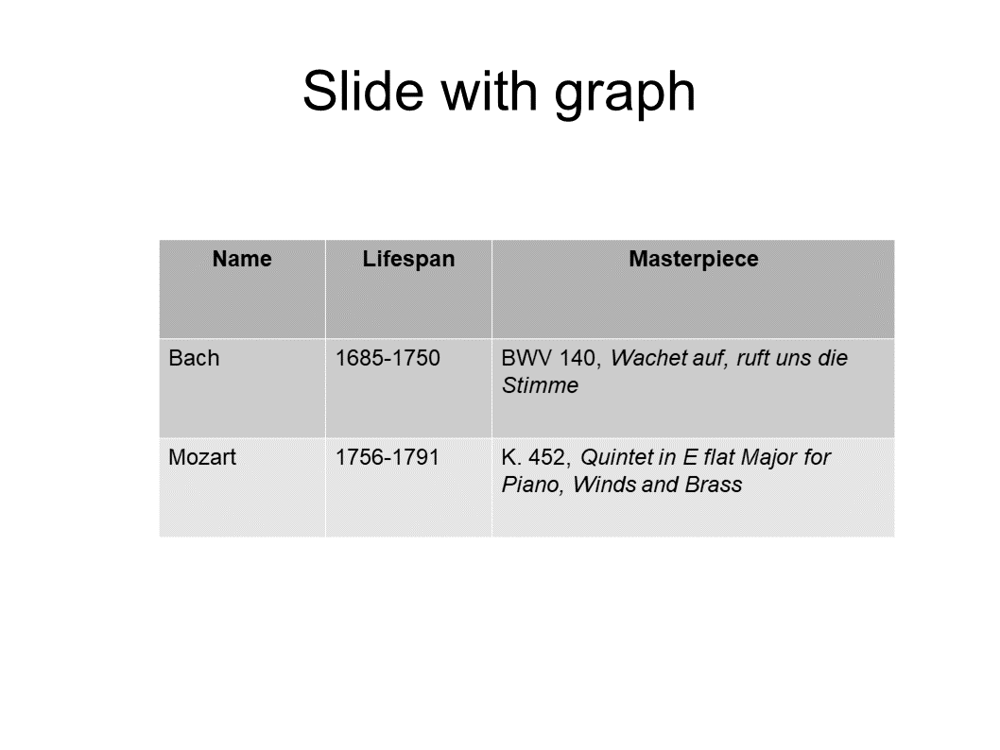
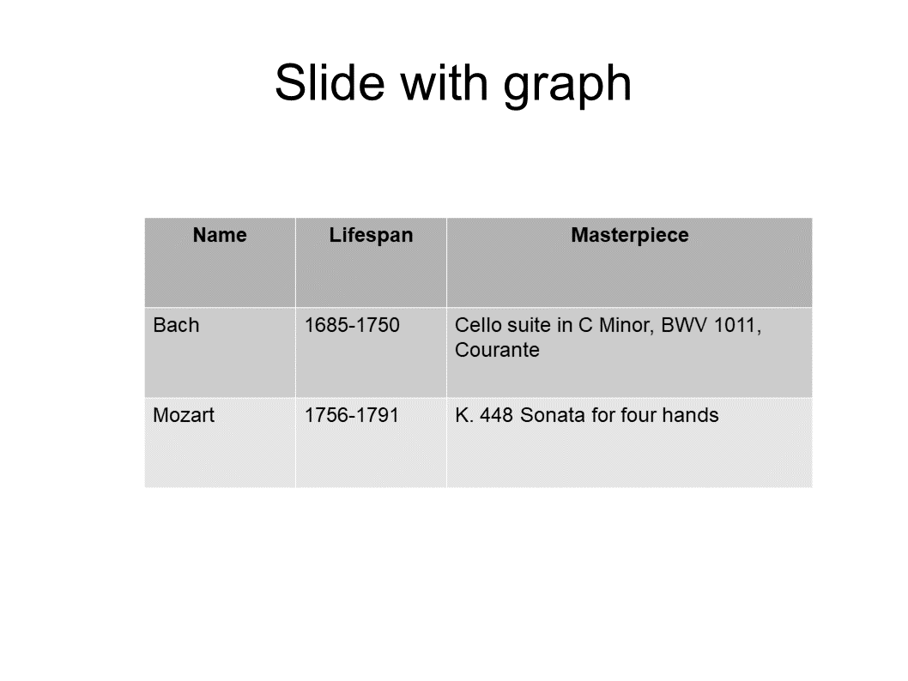

# TranslatePPTX

TranslatePPTX
is a very simple code based on the
[Apache POI](https://poi.apache.org) package
for facilitating editing or translation of Powerpoint
presentations in `.pptx` format.

Using
TranslatePPTX
to edit or translate a Powerpoint file is a three-step process:

1. You do a first run of TranslatePPTX
   on your `.pptx` file in *text extraction* mode.
   TranslatePPTX
   extracts all text strings on all slides in the presentation 
   (including all text boxes, all text in graphs, etc.) and 
   writes these out, with some identifying labeling info,
   to a **plain text file**.

2. You edit this file in your favorite text editor,
   modifying any text strings that you want to edit or translate
   and deleting all the rest. 

3.  Finally, you pass your edited list of text strings as a
    command-line argument to a second run of
    TranslatePPTX
    now running in *text replacement* mode;
    this time the code replaces all the strings you edited with 
    your edited versions and writes out a new `.pptx` file
    reflecting your edits.

## A tutorial example

Here's an example involving a presentation called
[`MyDeck.pptx`](example/MyDeck.pptx),
which contains two slides and has a couple of text boxes
and a table:

<p align="center">

<table>
 <tr>
 <th> Slide 1</th>
 <th> Slide 2</th>
 </tr>
 <tr>
  <td> <a href="example/MyDeck_Slide1.png">
       
       </a>
  <td> <a href="example/MyDeck_Slide2.png">
       
       </a>
 </tr>
</table>

### Step 1: Extract text strings

````bash
 % TranslatePPTX.sh MyDeck.pptx

Wrote 8 text strings to MyDeck.text
 (9 text runs, 9 table entries)
Thank you for your support.
````

This produces a file named `MyDeck.text,`
which looks like this:

````
--------------------------------------------------
## Slide 1: Homer’s Deck
--------------------------------------------------

TEXT_STRING 2 0
==================================================
This is a text box.
==================================================

TEXT_STRING 3 0
==================================================
Huge red Courier font and comic italics

==================================================

TEXT_STRING 3 1
==================================================
Huge red Courier 
==================================================

TEXT_STRING 3 2
==================================================
font 
==================================================

TEXT_STRING 3 3
==================================================
and comic italics
==================================================

TEXT_STRING 5 0
==================================================
これは日本語である。
==================================================

TEXT_STRING 4 0
==================================================
我是中文！
==================================================

--------------------------------------------------
## Slide 2: Slide with graph
--------------------------------------------------

TEXT_STRING 7 0 (table)
==================================================
Name
==================================================

TEXT_STRING 8 0 (table)
==================================================
Lifespan
==================================================

TEXT_STRING 9 0 (table)
==================================================
Masterpiece
==================================================

TEXT_STRING 10 0 (table)
==================================================
Bach
==================================================

TEXT_STRING 11 0 (table)
==================================================
1685-1750
==================================================

TEXT_STRING 12 0 (table)
==================================================
BWV 140, Wachet auf, ruft uns die Stimme
==================================================

TEXT_STRING 13 0 (table)
==================================================
Mozart
==================================================

TEXT_STRING 14 0 (table)
==================================================
1756-1791
==================================================

TEXT_STRING 15 0 (table)
==================================================
K. 452, Quintet in E flat Major for Piano, Winds and Brass
==================================================

TEXT_STRING 16 0
==================================================
Slide with graph
==================================================

````

Note the following points here:

1. Each text string appears between two separator
strings comprised of equals signs (`======.....=====`),
prepended by an identifier string of the form
`TEXT_STRING M N` where `M` and `N` are integers.

2. Some text strings seem to be appearing *twice*;
for example, the text "Huge red Courier font and comic italics"
appears 

 + once in full with indices `(M,N)=(3,0),` and

 + again split into three pieces with indices
   `(M,N)=(3,1) (3,2) (3,3)`.

This is discussed in more detail [below](README.md#ShapesRuns).

### Step 2: Edit text strings

Now you use your favorite text editor to edit
any of the text strings you want to modify, deleting
the ones you don't. (Or you can just leave them there
to be re-written as-is to the output file, although this
will slow things down for huge files.)

In this case, I will copy `MyDeck.text` to a new file called
`MyDeck.translations` and make edits to just a few of the 
text strings; after I've finished making my edits, the `MyDeck.translations`
file looks like this:

````bash

TEXT_STRING 2 0
==================================================
This is a wonderful text box.
==================================================

TEXT_STRING 3 3
==================================================
and awesome comic italics
==================================================

TEXT_STRING 5 0
==================================================
This was previously Japanese!
==================================================

TEXT_STRING 4 0
==================================================
I was previously Mandarin!
==================================================

TEXT_STRING 6 1
==================================================
Homer's Translated Deck
==================================================

TEXT_STRING 6 2
==================================================

==================================================


--------------------------------------------------
## Slide 2:Slide with graph
--------------------------------------------------

TEXT_STRING 12 0 (table)
==================================================
Cello suite in C Minor, BWV 1011, Courante
==================================================

TEXT_STRING 15 0 (table)
==================================================
K. 448 Sonata for four hands
==================================================
 
````

### Step 3: Replace text strings

Finally, you do a second run of TranslatePPTX
with the same `.pptx` file but now using
the new command-line argument `--Translations`
used to specify the list of revised text strings:

````bash
 % java TranslatePPTX.sh MyDeck.pptx --Translations MyDeck.translations
Wrote translated document to MyDeck_Translated.pptx.
Thank you for your support.
````

This produces a new `.pptx` file called `MyDeck_Translated.pptx,`
whose slides now look like this:

<p align="center">

<table>
 <tr>
 <th> Slide 1</th>
 <th> Slide 2</th>
 </tr>
 <tr>
  <td> <a href="example/MyDeck_Translated_Slide1.png">
       
       </a>
  <td> <a href="example/MyDeck_Translated_Slide2.png">
       
       </a>
 </tr>
</table>

<a name="CommandLineOptions"></a>
## Other command-line options

There are a couple of other command-line options, which you can
see by running `TranslatePPTX` with no options:

````
% TranslatePPTX

usage: TranslatePPTX Original.pptx [options]

 options: 
  --Translations Translations.txt
  --WriteLog
  --WideOnly

````

The additional options here are:

+ `--WriteLog`
    Requests that TranslatePPTX write a `.log` file explaining what is doing.
    This is useful for debugging.

+ `--WideOnly`
    Requests that only text strings containing double-byte characters (i.e. characters in Japanese, Chinese, or other languages) be considered. 
<a name="ShapesRuns"></a>
## Text shapes vs. text runs

As noted above, some text strings in `.pptx` files
appear *twice* within the the `.text` file produced by TranslatePPTX
What's going on here is that PowerPoint internally distinguishes
between *text shapes* and *text runs.* Text shapes are larger-scale
entities that consist of one or more text runs. Each text run
has a fixed font size and color.
In most cases, it is convenient to edit entire text shapes all at
once; however, for cases in which a single text shape
includes multiple distinct fonts/colors, you will want to 
edit the individual text runs to preserve that fine-grained detail.

TranslatePPTX allows for both of these possibilities. For the Nth
text shape in your `.pptx` file, the `.text` file includes

 +one `TEXT_STRING` with indices `N 0` containing the full text of the shape (including the contributions of all text runs), and

 +separate `TEXT_STRING`s with indices `N 1`, `N 2`, ..., `N M` (where `M` is the total number of text runs in the shape).

You will want to edit *either* the former *or* the latter of these and *delete* the other one.
Thus, if you need to preserve the formatting or positioning of individual
text runs, delete `TEXT_STRING N 0` and edit one or more of the `TEXT_STRING N M` sections
for the individual runs. (You may also simply clear out the text of one of the text runs, in which case TranslatePPTX will *delete* that text run when it constructs the translated `.pptx` file.)
Otherwise, edit the full string reported for `TEXT_STRING N 0` and delete all of the individual `TEXT_STRING N M` sections.

## Installation

### Install requisite packages

You will need Java version 1.8 and the [Apache POI](https://poi.apache.org) source distribution.

### Building TranslatePPTX

Eventually this project needs a `build.xml` file in its top-level directory
to drive the `ant` build process. Since I don't know how to write one, for the time
being I use the following simple procedure which works fine in practice:

1. Copy the `src/TranslatePPTX.java` from the TranslatePPTX repository into the `src/ooxml/java/org/apache/poi/xslf/extractor` subdirectory of your Apache POI installation. Thus, assuming the environment variable POIHOME points to the root of your POI installation, from the head of the TranslatePPTX repository simply say 

````bash
% cp ${TRANSLATEPPTX}/src/TranslatePPTX.java ${POIHOME}/src/ooxml/java/org/apache/poi/xslf/extractor
````
2. Now just (re-)build the POI tree in the usual way, which for me is simply to say `ant jar`:

````bash
% cd ${POIHOME}
% ant jar
````

The first time you build POI from source, it takes a long time (half an hour or so), but subsequently rebuilding after adding `TranslatePPTX.java` only takes about a minute.

3. Now you can run `TranslatePPTX` from 
